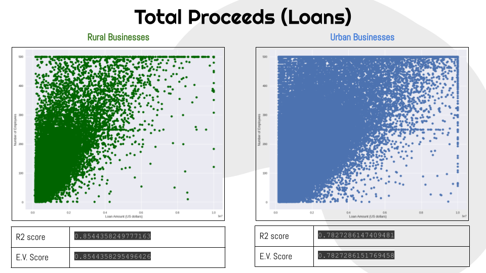
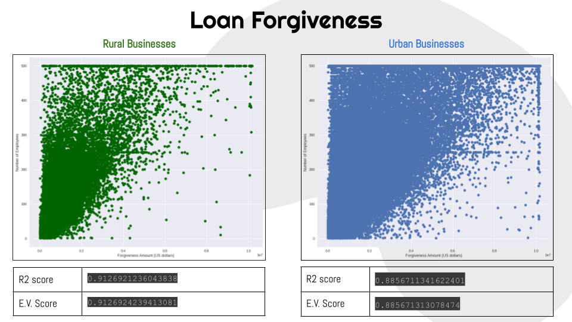
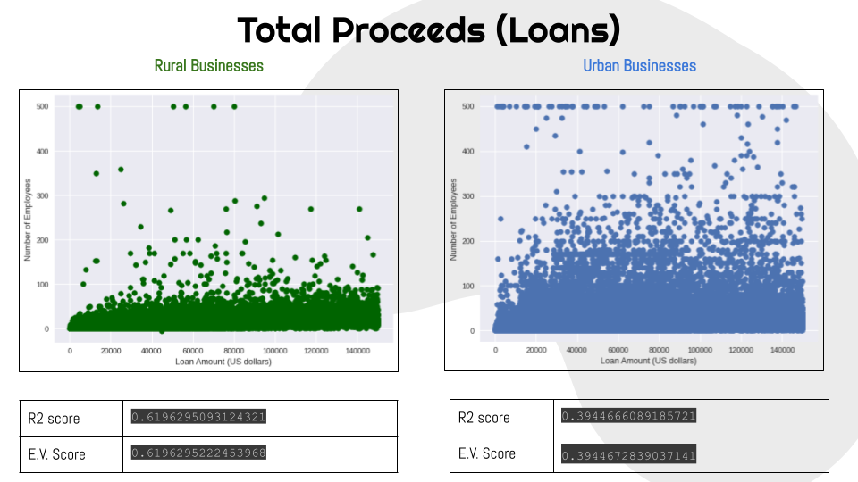
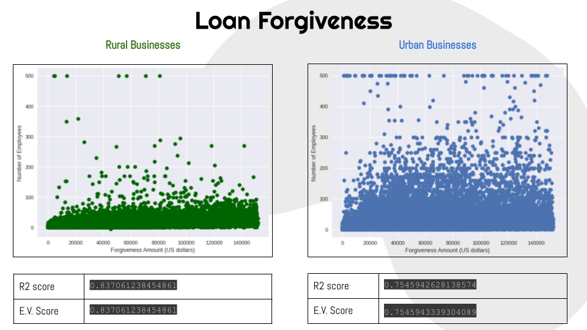

# Introduction
 
This is a project made in the span of 2 weeks analyzing the fairness of the Paycheck Protection Program using government datasets. This was made for the [Arkansas Summer Research Institute](https://www.arkansasedc.com/science-technology/division/data-analytics-that-are-robust-trusted-(dart)/arkansas-summer-research-institute) in 2022.

### Hypothesis

**_"Having a small business in an urban area in the U.S. increases the amount of money loaned and loans forgiven as the number of employees increases"_**

## Analysis

The data was divided into businesses loaned over 150K and businesses less than 150K. The method used to analyze the data was linear regression.

Number of entries are as follows:

- **Businesses loaned over 150k**
  - **Rural entries** = 136192
  - **Urban Entries** = 738629
 

- **Businesses loaned less than 150k**
  - **Rural entries** = 365688
  - **Urban Entries** = 978972 

## Results

Hypothesis was somewhat proven.

- The amount of money loaned and money forgiven does increase as the number of employees increase. However, this is only true for businesses that were loaned and forgiven for more than 150k.
- Data shows that urban fund trends are for the most part equal to rural fund trends.

